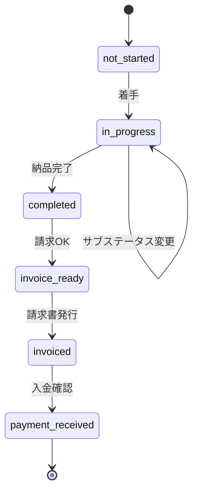

## 仕様

### プロジェクト概要

フリーランスWebデベロッパー（一人運用）向けの案件管理ツール。案件・クライアント・請求・作業時間の管理を、これまでNotionで行っていたものから、Reactで構築した専用アプリへ移行する。Notionはグラフ表示が有料版に限られ、請求書の作成もできないため、それらを補う目的で個人開発に至った。

**開発の背景**  
基本的な機能は Notion での運用を踏襲している。misoca API を使って請求書の作成・連携をアプリに組み込みたかったことが主な動機。あわせて、発注者に技術力を示すポートフォリオとして、触れるデモ付きの自作アプリを持ちたいというニーズもある。

---

### 技術スタック

```
フロントエンド
├── Vite + React 18 + TypeScript
├── Tailwind CSS + shadcn/ui
├── dnd-kit（カンバンD&D）
├── Zustand（UI状態管理）
├── TanStack Query（データフェッチ）
├── Recharts（売上グラフ）
├── date-fns（日付処理）
└── lucide-react（アイコン）

バックエンド・DB
└── Supabase（PostgreSQL + Auth + RLS）

外部連携
├── Google Calendar API（OAuth2.0）
└── misoca API（OAuth2.0）

デプロイ
└── Vercel
```

---

### アーキテクチャ

#### フォルダ構成

```
src/
├── api/             … Supabase CRUD（clients, projects, invoices, workLogs）
├── components/
│   ├── layout/      … AppLayout, Header, Sidebar
│   └── ui/          … shadcn/ui（button, card, input, label, skeleton）
├── features/
│   ├── auth/        … LoginPage, ProtectedRoute
│   ├── kanban/      … KanbanPage, KanbanCard, KanbanColumn, KanbanFilters, ProjectsTable
│   ├── projects/    … ProjectDetailPage, ProjectNewPage, ProjectForm
│   ├── clients/     … ClientsPage, ClientDetailPage, ClientForm
│   ├── dashboard/   … DashboardPage, KPI・グラフコンポーネント, dashboardStats
│   └── invoices/    … InvoicesPage, InvoiceNewPage
├── hooks/           … useProjects, useClients, useInvoices, useWorkLogs, useCurrentUser
├── stores/          … authStore, kanbanStore, themeStore（Zustand）
├── types/           … database.ts, enums.ts
└── lib/             … supabase.ts, utils.ts
```

#### 設計方針
- **TanStack Query**: サーバー状態（CRUD の取得・更新）
- **Zustand**: UI ローカル状態（カンバンフィルタ、テーマ、デモモード判定）
- **認証**: Supabase Auth + ProtectedRoute。デモユーザーは固定 ID で判定
- **エラー処理**: グローバル ErrorBoundary + 各画面でのローディング/エラー/空状態表示
- **コード分割**: 全ページを React.lazy で遅延読み込み
- **環境変数**: `VITE_SUPABASE_URL`, `VITE_SUPABASE_ANON_KEY`, `VITE_DEMO_USER_EMAIL`, `VITE_DEMO_USER_PASSWORD`

---

### DB設計

全テーブル共通: `user_id`（uuid FK → auth.users）で RLS により CRUD を制限。`updated_at`（timestamp）を保持。スキーマ: `supabase/migrations/001_initial_schema.sql`

#### テーブル一覧

| テーブル | 主要カラム |
|----------|-----------|
| `clients` | name, company_name, representative, billing_email, phone, address, notes |
| `projects` | client_id(FK), name, category, status, sub_status, billing_type, amount, hourly_rate, priority, start_date, end_date, invoice_date, payment_date, progress, gcal_event_id, memo |
| `work_logs` | project_id(FK), started_at, ended_at, duration(秒), memo |
| `invoices` | project_id(FK), status, amount, misoca_id, issued_at, sent_at, paid_at |

#### Enum定義（`src/types/enums.ts`）

| 用途 | 値 |
|------|-----|
| `projects.status` | `not_started`, `in_progress`, `completed`, `payment_received`（カンバン4列） |
| `projects.sub_status` | `in_progress`, `waiting_client`, `invoice_ready`, `invoiced`, `paid` |
| `projects.priority` | `high`, `medium`, `low` |
| `projects.billing_type` | `fixed`（一式）, `hourly`（時間単価） |
| `projects.category` | 新規開発, 保守, 運用, その他（プリセット + 自由入力） |
| `invoices.status` | `draft`, `sent_to_misoca`, `sent_to_client`, `paid` |

#### ステータス遷移（案件）



#### インデックス
- `(user_id)`, `(client_id)`, `(project_id)`, `(status)`, `(started_at)` 等

---

### 画面構成

```
/login             ログイン（デモログインボタン付き）
/                  カンバンボード（メイン）
/projects/new      案件作成
/projects/:id      案件詳細・編集
/clients           クライアント一覧
/clients/:id       クライアント詳細・編集
/dashboard         売上ダッシュボード
/invoices          請求一覧
/invoice/new       請求書作成（?project_id=xxx）
```

---

### UI/UX

- **レイアウト**: サイドバー（ナビゲーション） + ヘッダー + メインエリア
- **レスポンシブ**: Tailwind デフォルトブレークポイント（sm/md/lg/xl）
- **状態表示**: ローディング=Skeleton、エラー=メッセージ+リトライ、空状態=案内メッセージ
- **テーマ**: ダークモード対応（shadcn/ui テーマ + Zustand で永続化）
- **色分け**: ステータスごとに統一（未着手=gray、進行中=blue、完了=green、入金完了=purple）

---

### 機能要件

#### カンバンボード
- 4列（未着手 / 進行中 / 完了 / 入金完了）、dnd-kit で D&D
- カンバン / テーブル表示切替
- テキスト検索、クライアント別・期間フィルタ
- カード表示項目のトグル（案件名、クライアント名、タイマー、優先度、進捗、金額）

#### 案件 CRUD
- 作成・詳細・編集。クライアント紐付け、ステータス/サブステータス/優先度/料金体系/進捗管理
- 案件詳細: 作業ログ一覧、累計稼働時間、時間単価案件の参考金額表示

#### クライアント CRUD
- 一覧（検索付き）・作成・詳細・編集。紐付き案件の表示

#### 売上ダッシュボード
- 期間フィルタ（月 / 四半期 / 年 / カスタム）
- KPI カード（今月売上、先月比、未入金合計、平均案件単価）
- グラフ: 月別売上推移、クライアント別売上、カテゴリ別売上、月別稼働時間

#### 請求書ワークフロー（misoca API 連携）
- 請求一覧: 一覧表示・検索・案件詳細への遷移
- 請求書作成フロー: **案件ステータスが「完了」(completed) になってから** `/invoice/new` で請求書作成可能。案件完了 → クライアント情報・金額の初期値設定 → misoca に下書き送信
- 請求金額: 一式案件は案件の金額を初期値とする。時間単価案件も含め、**実際の請求金額はユーザーが入力**する（タイマー・work_logs の稼働時間は請求書の金額算出に使用しない）
- ステータスでライフサイクル管理。OAuth2.0（API キー未取得）

#### タイマー機能
- 案件カードからタイマー開始・停止 → work_logs へ記録
- 状態永続化（localStorage or Supabase）。同時計測は1案件のみ
- ヘッダーに計測中の案件名と経過時間をグローバル表示
- work_logs の手動追加・編集
- **稼働時間はあくまで目安**。請求書の金額算出には使用しない

#### Google カレンダー連携
- 案件登録・日程変更時に GCal イベントを自動作成・更新
- OAuth2.0（個人アカウント・テストモード運用）

#### 認証・デモモード
- Supabase Auth（メール/パスワード）。ProtectedRoute で保護
- デモログインボタン。デモモード時はヘッダーにバナー表示
- デモデータの定期リセット / セッション初期化
- デモユーザー向け API 制限・外部 API モック

#### その他
- 通知・リマインダー（納期・請求期限）
- 案件アーカイブ（入金完了後の非表示）

---

### 非機能要件
- 一人運用（マルチユーザー不要）
- レスポンシブ対応
- ダークモード対応
- ポートフォリオとして GitHub 公開・Vercel デプロイ
- ESLint + Prettier、Vitest（CI/CD は未設定）