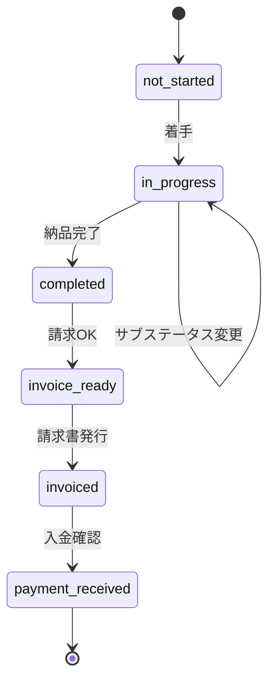
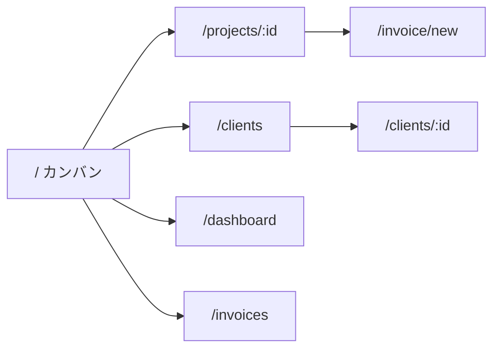

## Cursor引き継ぎドキュメント

### プロジェクト概要
NotionからReactアプリへ移行する案件管理ツール。フリーランスWebデベロッパー（一人運用）向け。**ポートフォリオ方針**: フリーランス案件の発注者向けに技術力をアピール。デモモードで閲覧者がアプリを実際に触れるようにする。UI・コード品質・設計・外部API連携・インタラクションをバランスよくアピールする。

---

### 技術スタック

```
フロントエンド
├── Vite + React + TypeScript
├── Tailwind CSS + shadcn/ui
├── dnd-kit（カンバンD&D）
├── Zustand（状態管理）
├── TanStack Query（データフェッチ）
└── Recharts（売上グラフ）

バックエンド・DB
└── Supabase（PostgreSQL + Auth）

外部連携
├── Google Calendar API（OAuth2.0）
└── misoca API（OAuth2.0）

デプロイ
└── Vercel
```

---

### 技術アーキテクチャ

#### フォルダ構成
- feature-based または layer-based のいずれかを採用し、具体的なディレクトリツリーは実装時に定義。例: `src/features/{kanban,projects,clients,dashboard,invoices}`, `src/api`, `src/components/ui`, `src/stores`, `src/hooks`。

#### Supabase クライアント
- API 呼び出しは Repository 層（または `src/api`）に集約。型は `supabase gen types typescript` で生成し、アプリ固有型は `src/types` で管理。

#### 状態管理の住み分け
- **TanStack Query**: サーバー状態（案件・クライアント・請求・work_logs の取得・更新）。
- **Zustand**: UI ローカル状態（タイマー、カンバン/一覧のフィルター、サイドバー開閉、デモモード判定など）。

#### 認証
- Supabase Auth + Protected Route（未認証はログインへリダイレクト）。デモユーザーは固定 ID で判定し、API 呼び出しをモック or 制限する分岐を用意。

#### 環境変数
- `.env.local` に `VITE_SUPABASE_URL`, `VITE_SUPABASE_ANON_KEY` 等を定義。一覧は実装時に README に記載。

#### 型定義
- Supabase 生成型をベースに、アプリ用の Enum・DTO を `src/types` で拡張。

#### エラーハンドリング
- グローバルな Error Boundary を設置。API エラーはトースト + 必要に応じてリトライを表示。

#### ポートフォリオ品質の技術要件
- **テスト**: Vitest でユーティリティの unit test、主要フローの integration test を最低限カバー。
- **CI/CD**: GitHub Actions で lint + type-check + test を実行。Vercel プレビューデプロイと連携。
- **パフォーマンス**: React.lazy によるコード分割、Lighthouse を意識。
- **アクセシビリティ**: shadcn/ui の a11y を活かし、キーボード・スクリーンリーダーを意識。
- **デモモード**: デモユーザー判定、外部 API のモック層、シードデータ投入（Supabase seed or アプリ起動時）を設計に含める。

---

### DB設計

全テーブル共通: Supabase Auth + RLS の前提として `user_id`（uuid FK → auth.users）と `updated_at`（timestamp）を保有する。

#### Enum定義

| 用途 | 値 | 備考 |
|------|-----|------|
| `projects.status` | `not_started`, `in_progress`, `completed`, `payment_received` | カンバン4列に対応 |
| `projects.sub_status` | 進行中: `in_progress`, `waiting_client` / 完了後: `invoice_ready`, `invoiced`, `paid` | カード内表示用 |
| `projects.priority` | `high`, `medium`, `low` | 高・中・低 |
| `projects.billing_type` | `fixed`, `hourly` | 一式 / 時間単価 |
| `projects.category` | 自由入力 or リスト（新規開発・保守・運用・その他） | 要決定 |
| `invoices.status` | `draft`, `sent_to_misoca`, `sent_to_client`, `paid` | 請求書のライフサイクル |

#### ステータス遷移（案件）



カンバン列と `projects.status` の対応: 未着手 → `not_started` / 進行中 → `in_progress` / 完了 → `completed` / 入金完了 → `payment_received`。

#### `clients`テーブル
```
id              uuid PK
user_id         uuid FK → auth.users (RLS用)
name            text
company_name    text          -- 法人名（請求書用）
representative  text
billing_email   text
phone           text
address         text           -- 住所（misoca請求書用）
notes           text
created_at      timestamp
updated_at      timestamp
```

#### `projects`テーブル
```
id              uuid PK
user_id         uuid FK → auth.users (RLS用)
client_id       uuid FK → clients.id
name            text
category        text           -- 新規開発・保守等（Enum or 自由入力）
status          text           -- not_started / in_progress / completed / payment_received
sub_status      text           -- カード内表示用（上記Enum参照）
billing_type    text           -- 'fixed'（一式） / 'hourly'（時間単価）
amount          numeric        -- 一式=契約金額 / 時間単価=請求時に手入力する金額
hourly_rate     numeric        -- billing_type='hourly' の場合のみ使用（円/時間）
memo            text
priority        text           -- high / medium / low
start_date      date
end_date        date
invoice_date    date
payment_date    date
progress        integer        -- 0~100
gcal_event_id   text           -- GCal同期用
created_at      timestamp
updated_at      timestamp
```

#### `work_logs`テーブル
```
id          uuid PK
user_id     uuid FK → auth.users (RLS用)
project_id  uuid FK → projects.id
started_at  timestamp
ended_at    timestamp
duration    integer           -- 秒
memo        text
created_at  timestamp
updated_at  timestamp
```

#### `invoices`テーブル（新設）
```
id            uuid PK
user_id       uuid FK → auth.users (RLS用)
project_id    uuid FK → projects.id
status        text            -- draft / sent_to_misoca / sent_to_client / paid
amount        numeric         -- 請求金額（手入力）
misoca_id     text            -- misoca連携用ID（任意）
issued_at     date            -- 発行日
sent_at       date            -- 送付日（任意）
paid_at       date            -- 入金日（任意）
created_at    timestamp
updated_at    timestamp
```

#### インデックス戦略
- `clients(user_id)`
- `projects(user_id)`, `projects(client_id)`, `projects(status)`
- `work_logs(user_id)`, `work_logs(project_id)`, `work_logs(started_at)`
- `invoices(user_id)`, `invoices(project_id)`, `invoices(status)`

#### Supabase RLSポリシー
- 全テーブル: `user_id = auth.uid()` で SELECT / INSERT / UPDATE / DELETE を制限（一人運用でもデータ保護）

---

### 画面構成

```
/                  カンバンボード（メイン）
/projects/:id      案件詳細
/clients           クライアント一覧
/clients/:id       クライアント詳細
/dashboard         売上ダッシュボード
/invoices          請求一覧（フィルタ: 未請求・請求済み・入金済み）
/invoice/new       請求書作成（?project_id=xxx）
/invoice/:id       請求書プレビュー・編集（misoca連携）
```

---

### UI/UX設計

#### レイアウト
- 全体: サイドバー + メインエリア。サイドバーにナビゲーション（カンバン、クライアント、ダッシュボード、請求一覧等）。
- **画面遷移**: サイドバーで各画面へ。カンバンカードクリック → 案件詳細。案件詳細から請求書作成 → /invoice/new。クライアント一覧 → クライアント詳細。主要フローはワイヤーフレームで整理（テキスト or 後で Figma）。



#### レスポンシブ
- ブレークポイントは Tailwind のデフォルト（sm/md/lg/xl）を前提に定義。モバイルではカンバンを横スクロール or リスト表示に切替える方式を採用（要決定）。

#### 状態表示
- ローディング: 各画面で Skeleton（shadcn/ui）を使用。エラー時はメッセージ + リトライ。空状態は「まだ案件がありません」等のメッセージとアクションを表示。操作結果はトーストでフィードバック。

#### ポートフォリオ品質のUI
- マイクロインタラクション: カンバン D&D 時のアニメーション、カード hover、ステータス変更時のトランジション（Framer Motion 検討）。
- ローディング: シマーUIで体感速度を向上。空状態はイラスト付き等でディテールを強化。
- 色: ステータスごとに統一（例: 未着手=gray、進行中=blue、完了=green、入金完了=purple）。
- タイポグラフィ: 日本語フォント（Noto Sans JP 等）を選定。ダークモードは shadcn/ui のテーマで対応。

---

### 機能要件

#### カンバンボード
- 4列：未着手 / 進行中 / 完了 / 入金完了
- サブステータスはカード内に表示
- クライアント別フィルタリング
- dnd-kitでドラッグ&ドロップ

#### 案件カード表示項目
- 案件名、クライアント名、契約金額（一式）または時間単価・参考稼働（時間単価）
- 優先度バッジ、進捗率、サブステータス
- タイマーボタン（作業時間計測）

#### 検索・フィルタ
- カンバン: テキスト検索、クライアント別フィルタ、期間フィルタ、複数条件の組み合わせ

#### 売上ダッシュボード

- **期間フィルター**  
  月 / 四半期 / 年 / カスタム範囲
- **KPIカード**  
  今月売上、先月比、未入金合計、平均案件単価
- **料金体系別集計**  
  - 一式: `projects.amount`（契約金額）で集計  
  - 時間単価: 請求書の `amount`（手入力額）で集計。ダッシュボードは確定した請求額ベース
- **グラフ**  
  - 月別売上推移（棒グラフ + 折れ線）  
  - クライアント別売上構成（円グラフ or 横棒）  
  - カテゴリ別売上  
  - 料金体系別（一式 vs 時間単価）の比率  
  - 月別稼働時間（work_logs ベース、全案件）  
  - 時間単価案件の実効時給（請求額 / 稼働時間）
- **売上計上タイミング**  
  `payment_date`（入金日）ベースか `end_date`（完了日）ベースかを実装時に定義

#### Googleカレンダー連携
- 案件登録時にGCalイベント自動作成
- 日程変更時も自動更新
- 個人GoogleアカウントのOAuth2.0（テストモードで運用）

#### タイマー機能

- **位置づけ**  
  タイマー / work_logs は自分用の作業記録。請求金額の自動計算には使わない。時間単価案件でも請求額は手入力。案件詳細では「累計稼働時間 × 時間単価 = 参考金額」を表示し、請求額の目安とする。
- 案件カードからタイマー開始・停止。バックグラウンドで計測し、停止時に work_logs へ記録。
- **状態永続化**  
  ブラウザリロード/閉じても計測継続（localStorage または Supabase に `active_timer` を保存）。
- **同時計測**  
  1案件のみ計測可能。他案件でタイマー開始時は現在の計測を停止するか確認する。
- **グローバル表示**  
  ヘッダーに計測中の案件名と経過時間を表示（全画面で表示）。
- **日報サマリー**  
  今日の作業時間合計を表示。
- **work_logs の手動編集**  
  タイマー忘れ対応で手動追加・編集を可能にする。
- **時間単価案件**  
  案件詳細に「累計稼働時間 × 時間単価 = 参考金額」を表示。

#### 請求書ワークフロー（misoca API連携）

- **`invoices` テーブルで請求履歴を管理**  
  ステータス: `draft` → `sent_to_misoca` → `sent_to_client` → `paid`
- **請求書作成フロー**  
  1. 案件が「完了」かつサブステータス「請求OK」のとき請求書作成ボタンを表示  
  2. クリックで `/invoice/new?project_id=xxx` に遷移  
  3. クライアント情報・金額が自動入力された編集フォームを表示（一式=契約金額、時間単価=手入力）  
  4. 「misocaに送信」でAPI経由で下書き作成  
  5. misoca側で最終確認・送付（手動）  
  6. アプリ側で「送付済み」「入金済み」を手動更新
- **請求一覧画面**  
  `/invoices` でフィルタ可能な一覧（未請求・請求済み・入金済み）

---

### 開発フェーズ

```
Phase1（メイン機能）
├── Supabase接続・認証
├── カンバンボード
├── 案件・クライアントCRUD
└── 売上グラフ

Phase2　Googleカレンダー連携
Phase3　タイマー機能
Phase4　misoca API連携
```

---

### ポートフォリオ / デモモード

#### デモモード
- ログイン画面に「デモアカウントで試す」ボタンを配置。専用デモユーザー（固定メール/PW）で自動ログイン。
- デモユーザーのデータは定期リセット or セッション単位で初期化する方式を採用（要決定）。
- **シードデータ**: クライアント 3〜5社（架空）、各ステータスに分散した案件 8〜12件、work_logs、請求書データ。単価・稼働時間はダッシュボードが見栄えする数値で用意。
- **機能制限**: Google Calendar / misoca はデモでは無効化 or モック。デモデータの削除は不可。変更はセッション内のみ or 定期リセットで運用。
- 画面上部に「デモモードで閲覧中」バナーを表示。制限がある操作にはツールチップで説明。

#### ランディング / 紹介画面
- Vercel デプロイ先の未認証ユーザー向けに、ログイン画面を兼ねるか別LPを設けるか決定。
- アプリのスクリーンショット or GIF で主要機能を紹介。「デモで試す」CTA を目立たせる。技術スタックを表示。

#### GitHub 公開品質
- **README.md**: スクリーンショット付き、機能一覧、技術スタック、アーキテクチャ図、セットアップ手順。
- コード品質: ESLint + Prettier、一貫した命名規則。コミットは意味のある粒度で（英語）。ライセンス（MIT 等）を設定。

#### 開発フェーズとの関係
- Phase1: デモ用認証・シードデータ基盤・ランディング画面を並行して構築。
- Phase2〜4: 各機能追加時にデモ用モック/シードデータも追加。

---

### 外部API情報

| サービス | 認証方式 | 備考 |
|---------|---------|------|
| Google Calendar | OAuth2.0 | 個人アカウント・テストモード運用 |
| misoca | OAuth2.0 | APIキー未取得。請求書作成までで送付は手動 |

---

### その他機能要件（補足）

#### 認証フロー
- Supabase Auth を使用。ログイン画面のデザインはランディング/デモと整合させる。
- 認証方式: メール/パスワード or Magic Link のいずれかを採用（実装時に決定）。
- 未認証時はログイン画面へリダイレクト（Protected Route）。

#### 通知・リマインダー
- 納期・請求期限が近い案件のアラートを画面内表示するか、メール通知するかは要否を実装時に決定。

#### データエクスポート
- 案件・クライアント・請求・作業ログのCSV出力の要否を実装時に決定。

#### 案件アーカイブ
- 入金完了後の案件をカンバンから非表示にするオプション（アーカイブ済みは一覧で別表示 or フィルタで切り替え）。

---

### 非機能要件
- 一人運用（マルチユーザー不要）
- レスポンシブ対応（モバイルでも使用）
- ダークモード対応
- ポートフォリオとしてGitHub公開・Vercelデプロイ